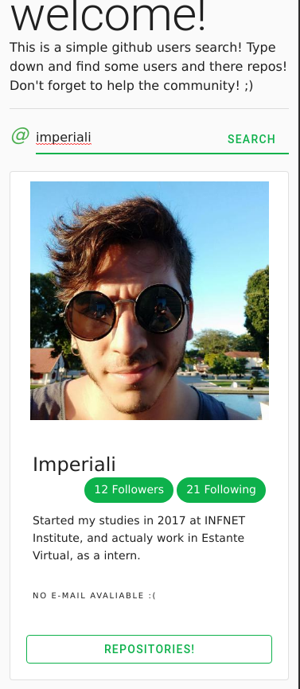

# git-find :shipit:

## The idea :bulb:

Make a web app that show some details of github users and display their repositories

<p align="center">
    
    
    
</p>

## Routes :vertical_traffic_light:

Going to the [home](http://git-find.firebaseapp.com)/{{User}} like this [exemple](http://git-find.firebaseapp.com/imperiali) you can see the user's repositories!

## Using :flashlight:

| Project | Status | Description |
|---------|--------|-------------|
| [vue-router]          | [![vue-router-status]][vue-router-package] | Single-page application routing |
| [vuex]                | [![vuex-status]][vuex-package] | Large-scale state management |
| [vue-cli]             | [![vue-cli-status]][vue-cli-package] | Project scaffolding |
| [vuetify]             | [![vuetify-status]][vuetify-package] | A semantic component framework for Vue |
| [vue-devtools]        | [![vue-devtools-status]][vue-devtools-package] | Browser DevTools extension |

[vue-router]: https://github.com/vuejs/vue-router
[vuetify]: https://github.com/vuetifyjs/vuetify
[vuex]: https://github.com/vuejs/vuex
[vue-cli]: https://github.com/vuejs/vue-cli
[vue-devtools]:  https://github.com/vuejs/vue-devtools

[vue-router-status]: https://img.shields.io/npm/v/vue-router.svg
[vuex-status]: https://img.shields.io/npm/v/vuex.svg
[vuetify-status]: https://img.shields.io/npm/v/vuetify.svg
[vue-cli-status]: https://img.shields.io/npm/v/@vue/cli.svg
[vue-devtools-status]: https://img.shields.io/chrome-web-store/v/nhdogjmejiglipccpnnnanhbledajbpd.svg

[vue-router-package]: https://npmjs.com/package/vue-router
[vuex-package]: https://npmjs.com/package/vuex
[vuetify-package]: https://npmjs.com/package/vuetify
[vue-cli-package]: https://npmjs.com/package/@vue/cli
[vue-devtools-package]: https://chrome.google.com/webstore/detail/vuejs-devtools/nhdogjmejiglipccpnnnanhbledajbpd


## 

## Project setup :hammer:
```
npm install
```

### Compiles and hot-reloads for development :up:
```
npm run serve
```

### Compiles and minifies for production :top:
```
npm run build
```

### Lints and fixes files :heavy_check_mark:
```
npm run lint
```

### Run your unit tests :white_check_mark:
```
npm run test:unit
```
